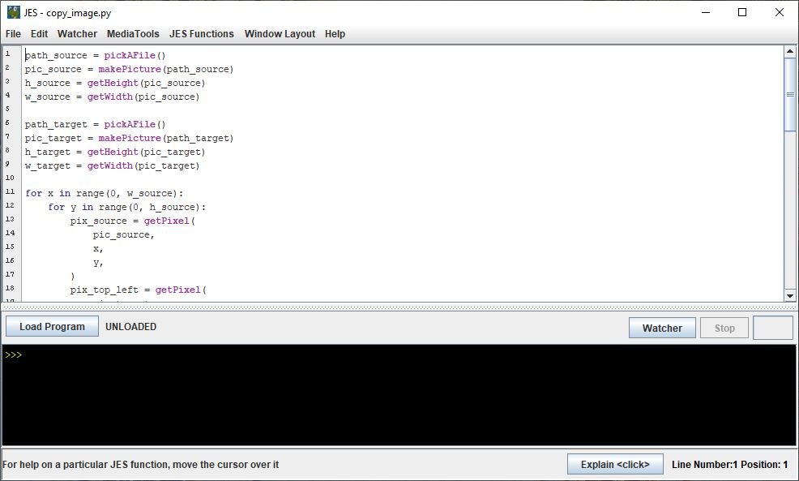
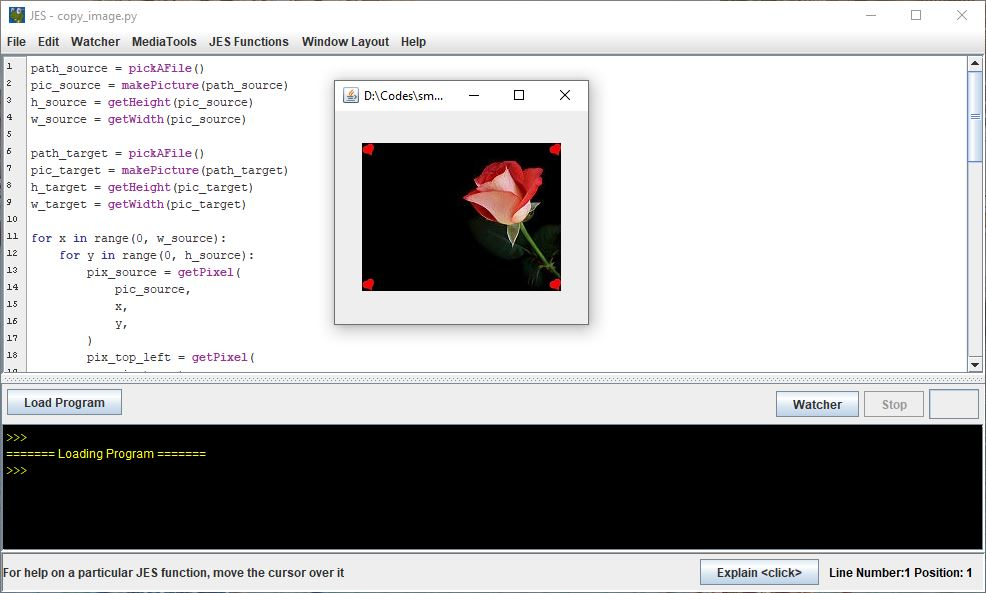

# Copy Image

This script runs in [JES](https://github.com/gatech-csl/jes) (Jython Environment for Students).
I stumbled on this old script when cleaning up my TA folders that age for over 10 years.
Interestingly it still works.

## Run

1. Install [JES 5.02](https://github.com/gatech-csl/jes/releases/tag/5.020).

2. Run JES, Open Program, then select this script

   

3. Load Program. Select the path for a source image then a target image. It will copy the source image to all 4 corners of the target image, as shown below.

   
